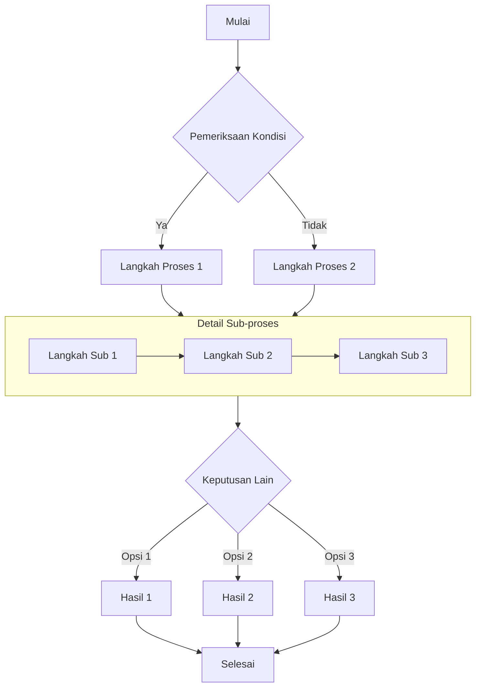
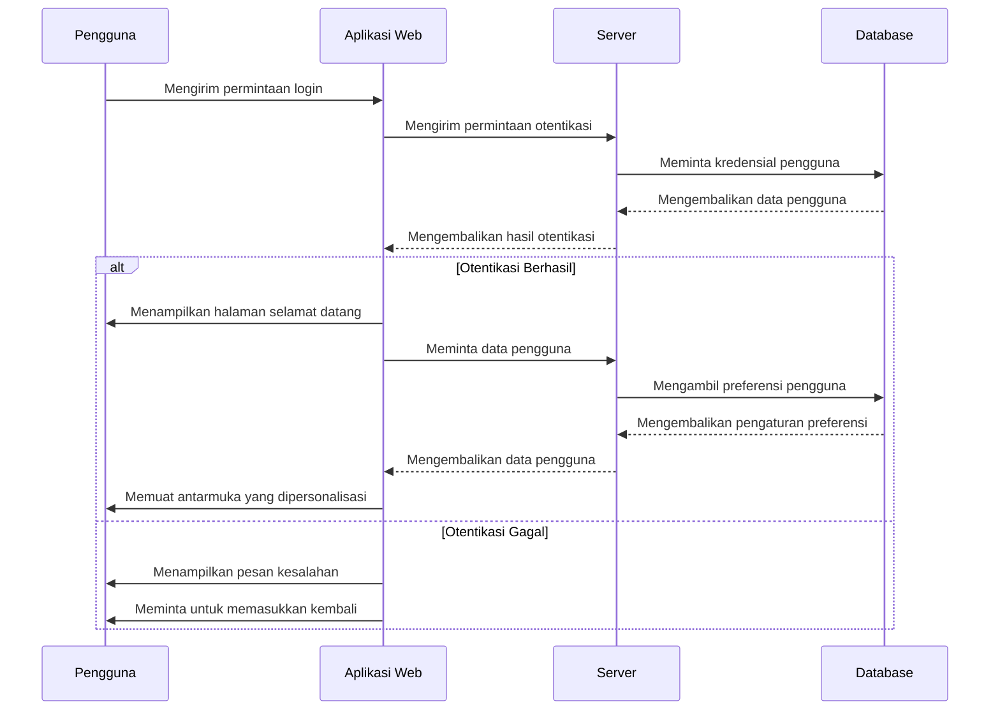
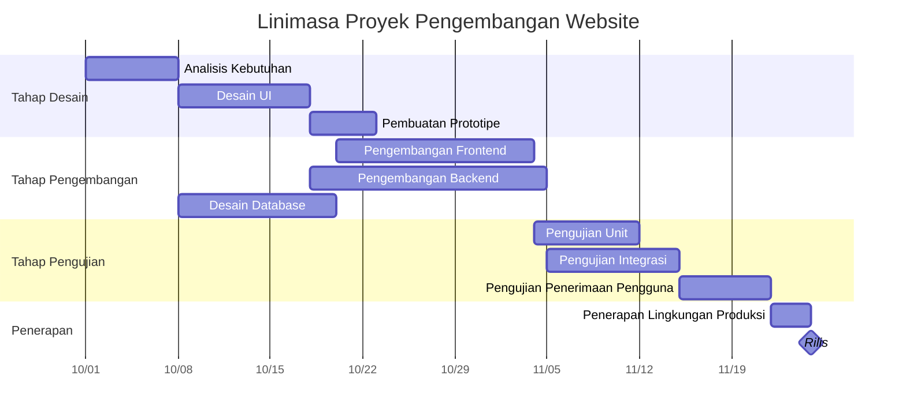
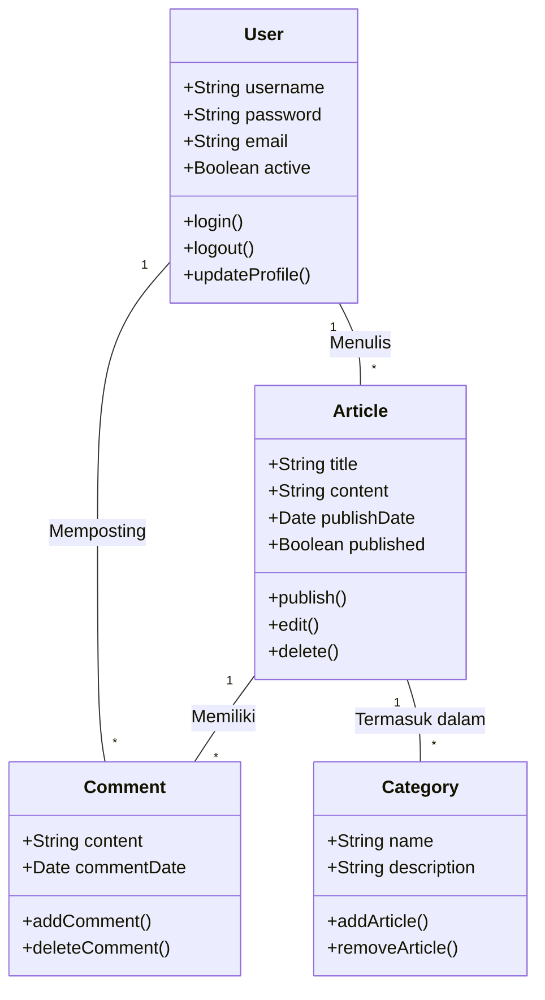
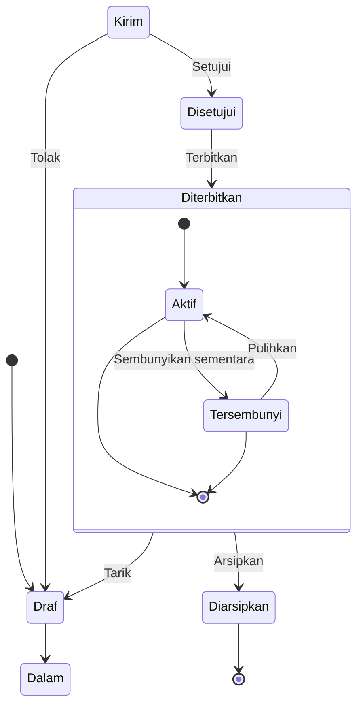
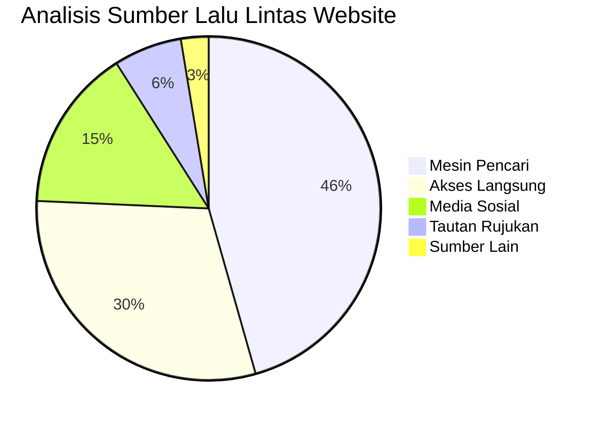

# Panduan Lengkap Diagram Mermaid di Markdown

Artikel ini mendemonstrasikan cara menggunakan Mermaid di dokumen Markdown untuk membuat berbagai diagram kompleks, termasuk diagram alur, diagram urutan, diagram Gantt, diagram kelas, dan diagram keadaan.

## Contoh Diagram Alur

Diagram alur sangat ideal untuk merepresentasikan proses atau langkah-langkah algoritma.

## Contoh Diagram Urutan

Diagram urutan menunjukkan interaksi antar objek dari waktu ke waktu.

## Contoh Diagram Gantt

Diagram Gantt sangat bagus untuk menampilkan kemajuan proyek dan linimasa.

## Contoh Diagram Kelas

Diagram kelas menunjukkan struktur statis sistem, termasuk kelas, atribut, metode, dan hubungannya.

## Contoh Diagram Keadaan

Diagram keadaan menunjukkan urutan keadaan yang dialami objek selama siklus hidupnya.

## Contoh Diagram Pai

Diagram pai sangat bagus untuk menampilkan data proporsi dan persentase.

## Ringkasan

Mermaid adalah alat yang kuat untuk membuat berbagai jenis diagram dalam dokumen Markdown. Artikel ini mendemonstrasikan cara menggunakan diagram alur, diagram urutan, diagram Gantt, diagram kelas, diagram keadaan, dan diagram pai. Diagram-diagram ini dapat membantu Anda mengekspresikan konsep, proses, dan struktur data yang kompleks dengan lebih jelas.

Untuk menggunakan Mermaid, cukup tentukan bahasa `mermaid` dalam blok kode dan gunakan sintaks teks sederhana untuk mendeskripsikan diagram. Mermaid akan secara otomatis mengubah deskripsi ini menjadi diagram visual yang indah.

Cobalah menggunakan diagram Mermaid di postingan blog teknis atau dokumentasi proyek Anda berikutnya - mereka akan membuat konten Anda lebih profesional dan lebih mudah dipahami!
